# Walmart Retail Sales — Demand Forecasting and Business Intelligence


---

## Project Overview

An end-to-end retail analytics project on the Walmart Store Sales Forecasting dataset (Kaggle).
The project covers the full data science pipeline — from exploratory data analysis and feature
engineering to machine learning models and an interactive Power BI dashboard.

**Core business problem:** Predict weekly department-level sales across 45 Walmart stores
and identify what drives high vs low performing weeks.

---

## Table of Contents

- [Dataset](#dataset)
- [Project Structure](#project-structure)
- [Pipeline](#pipeline)
- [Phase 1 — EDA](#phase-1--exploratory-data-analysis)
- [Phase 2 — Insights](#phase-2--pandas-insights & SQL Analysis).
- [Phase 3 — Feature Engineering](#phase-3--feature-engineering)
- [Phase 4 — XGBoost Regressor](#phase-4--xgboost-regressor)
- [Phase 5 — Classification Models](#phase-5--classification-models)
- [Phase 6 — Power BI Dashboard](#phase-6--power-bi-dashboard)
- [Key Results](#key-results)
- [Leakage Prevention](#leakage-prevention)
- [Tech Stack](#tech-stack)
- [How to Run](#how-to-run)
- [Author](#author)

---

## Dataset

**Source:** [Walmart Store Sales Forecasting — Kaggle](https://www.kaggle.com/competitions/walmart-recruiting-store-sales-forecasting)

| File | Description | Rows |
|---|---|---|
| train.csv | Weekly sales per store and department | 421,570 |
| stores.csv | Store type (A/B/C) and size | 45 |
| features.csv | Markdowns, CPI, temperature, unemployment | 8,190 |
| test.csv | Future weeks for prediction | 115,064 |

**Date range:** February 2010 to October 2012
**Stores:** 45 | **Departments:** 81 | **Total weeks:** 143

> The data/ folder is excluded from this repository. Download the dataset from Kaggle and place all CSV files in the data/ folder before running the notebooks.

---

## Project Structure

```
walmart-retail-analytics/
│
├── data/                                   <- Download from Kaggle (not in repo)
│   ├── train.csv
│   ├── test.csv
│   ├── features.csv
│   ├── stores.csv
│   ├── master_df.csv                       <- Generated by EDA notebook
│   └── model_df.csv                        <- Generated by Feature Engineering notebook
│
├── notebooks/
│   ├── 01_EDA.ipynb
│   ├── 02_Pandas_Insights.ipynb
│   ├── 03_Feature_Engineering.ipynb
│   ├── 04_XGBoost_Final_v2.ipynb
│   └── 05_XGBoost_Classifier.ipynb
├── walmart_sql_analysis.sql    <- 15 business queries across store, department, holiday and markdown analysis
│   
├── output/
│   ├── EDA/
│   │   ├── 01_missing_values.png
│   │   ├── 02_sales_distribution.png
│   │   ├── 03_sales_over_time.png
│   │   ├── 04_monthly_sales.png
│   │   ├── 05_yearly_sales.png
│   │   ├── 06_store_total_sales.png
│   │   ├── 07_store_type_analysis.png
│   │   ├── 08_size_vs_sales.png
│   │   ├── 09_dept_sales.png
│   │   ├── 10_holiday_impact.png
│   │   ├── 11_named_holidays.png
│   │   ├── 12_markdown_impact.png
│   │   ├── 13_markdown_types.png
│   │   ├── 14_external_factors.png
│   │   └── 15_correlation_heatmap.png
│   ├── pandas_insights/
│   │   ├── 01_store_type_overview.png
│   │   ├── 02_holiday_performance.png
│   │   ├── 03_seasonality_overview.png
│   │   └── 04_dept_pareto.png
│   ├── FeatureEngineering/
│   │   └── feature_importance_correlation.png
│   ├── xgbregressor/
│   │   ├── xgb_final_model_comparison.png
│   │   ├── xgb_final_feature_importance.png
│   │   ├── xgb_final_actual_vs_predicted.png
│   │   └── xgb_final_store_dept_predictions.png
│   ├── classifier/
│   │   ├── classifier_class_balance.png
│   │   ├── classifier_model_comparison.png
│   │   ├── classifier_confusion_matrices.png
│   │   ├── classifier_feature_importance.png
│   │   └── classifier_roc_curves.png
│   └── power bi/
│       ├── page1_executive_overview.png
│       ├── page2_store_dept_analysis.png
│       ├── page3_seasonality_holiday.png
│       └── page4_markdown_analysis.png
│
├── walmart_Power_BI_report.pbix
├── .gitignore
└── README.md
```

---

## Pipeline

```
Raw Data (train.csv + stores.csv + features.csv)
        ↓
Exploratory Data Analysis
        ↓
Pandas Insights (business questions answered)
        ↓
Feature Engineering (40 leakage-free features)
        ↓
TimeSeriesSplit CV → XGBoost Regressor
        ↓
TimeSeriesSplit CV → XGBoost Classifier + Random Forest
        ↓
Power BI Dashboard (4 pages)
```

---

## Phase 1 — Exploratory Data Analysis

**Notebook:** `notebooks/01_EDA.ipynb`

**Key findings:**
- 421,570 weekly sales records across 45 stores and 81 departments
- 1,285 negative sales rows (0.3%) — clipped to 0
- MarkDown columns have 64-73% null values — filled with 0
- Type A stores average $20,100/week — 67% more than Type C
- Store size has 0.846 correlation with total sales
- Holiday weeks show 7.1% higher average sales than normal weeks
- December and November are peak months driven by holiday shopping

**Charts:**

| Chart | Description |
|---|---|
| 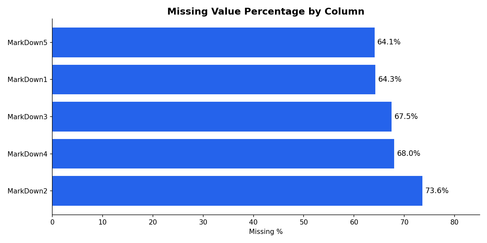 | Missing value percentage by column |
| 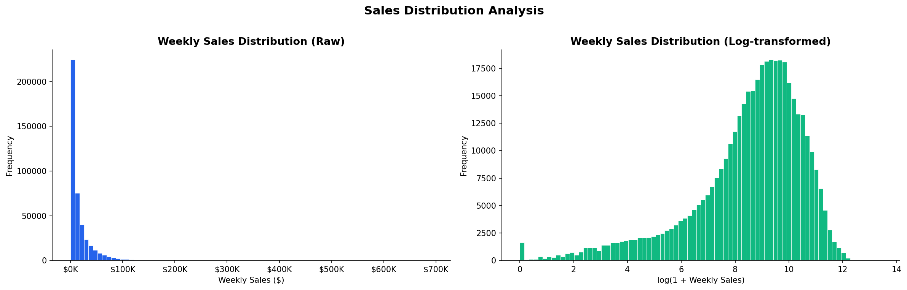 | Weekly sales distribution — raw and log transformed |
| 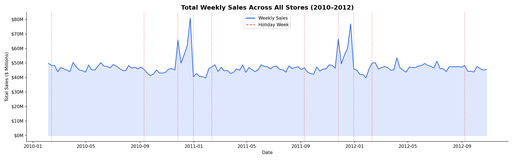 | Total weekly sales trend with holiday markers |
| 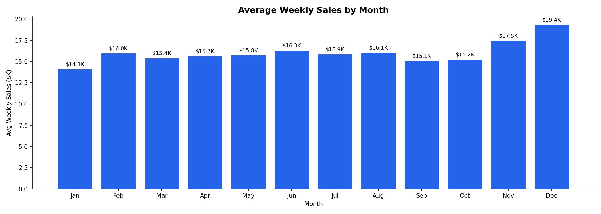 | Average weekly sales by month |
| 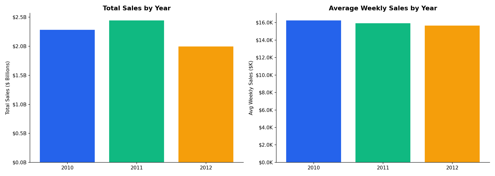 | Total and average sales by year |
| 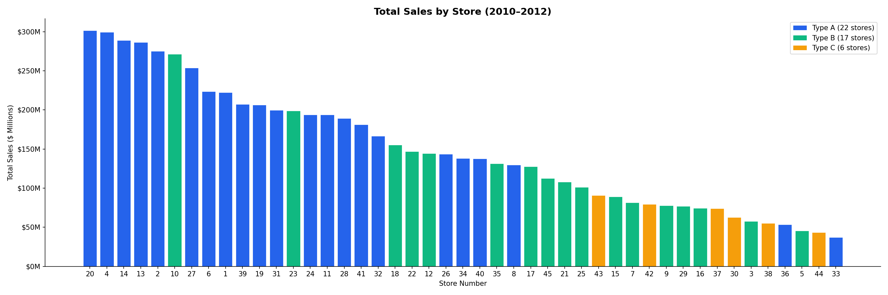 | Total sales by store colored by type |
| 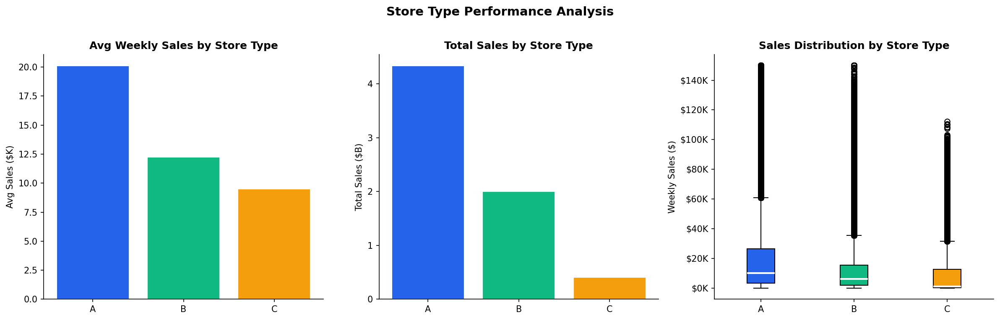 | Store type performance comparison |
| 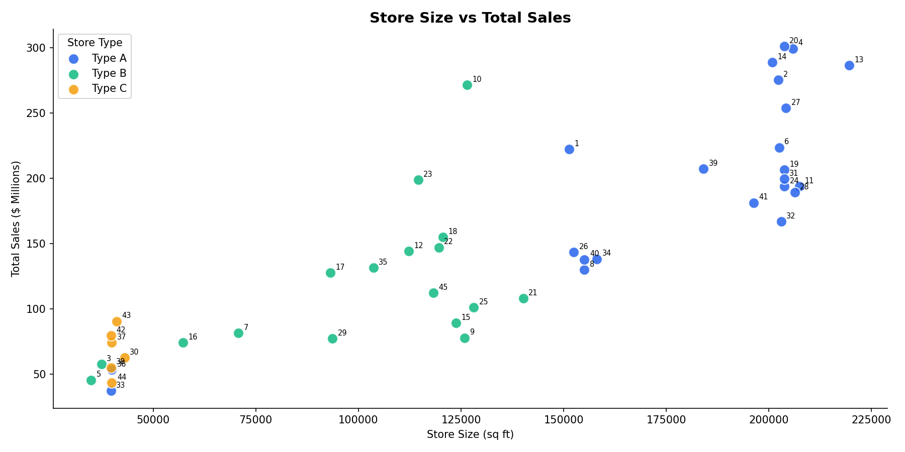 | Store size vs total sales scatter plot |
| 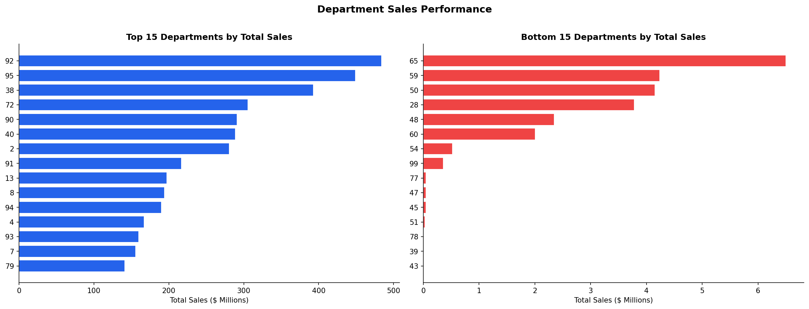 | Top and bottom departments by sales |
| 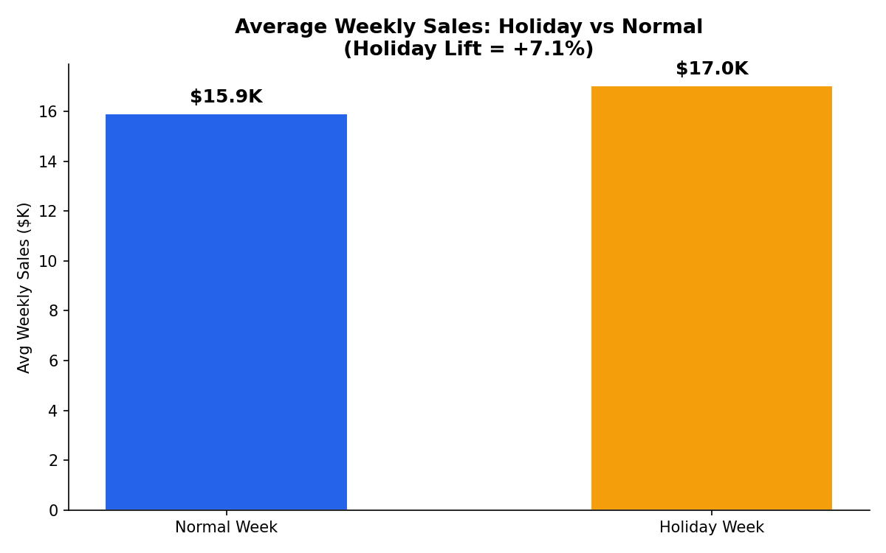 | Holiday vs normal week average sales |
| 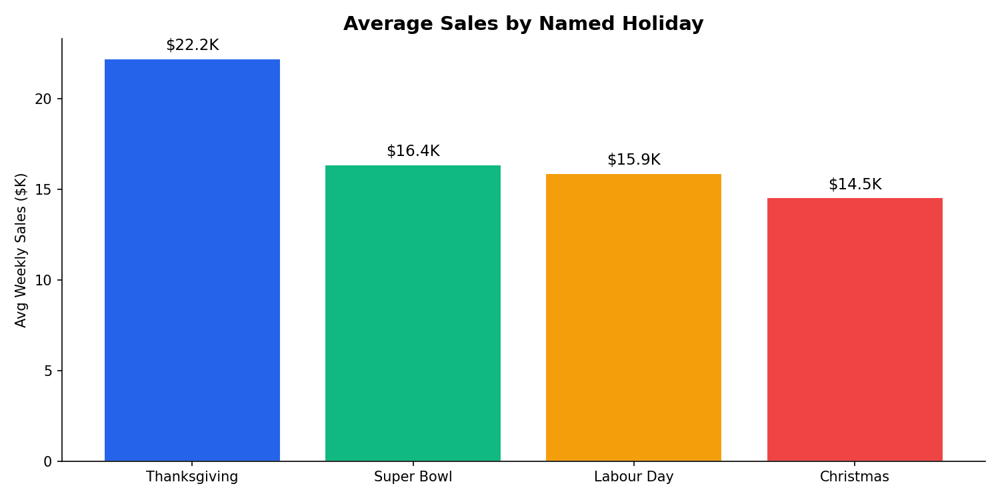 | Sales by named holiday event |
| 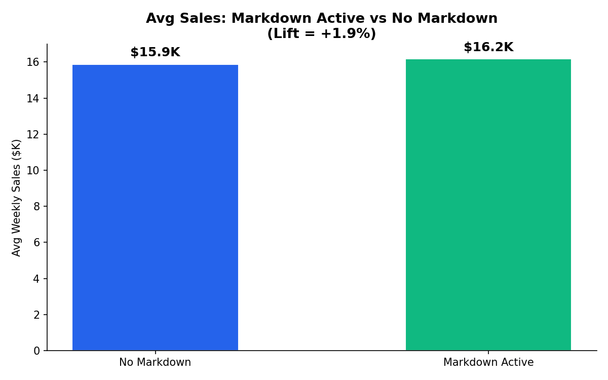 | Markdown active vs no markdown sales |
| 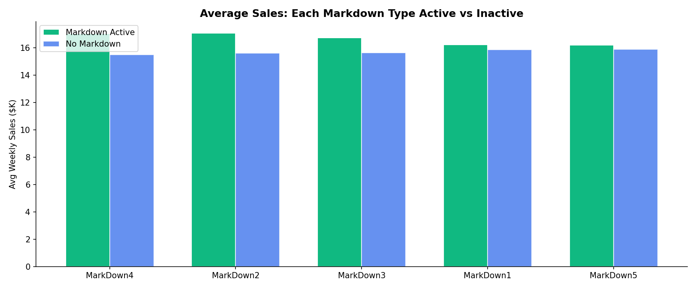 | Each markdown type lift comparison |
| 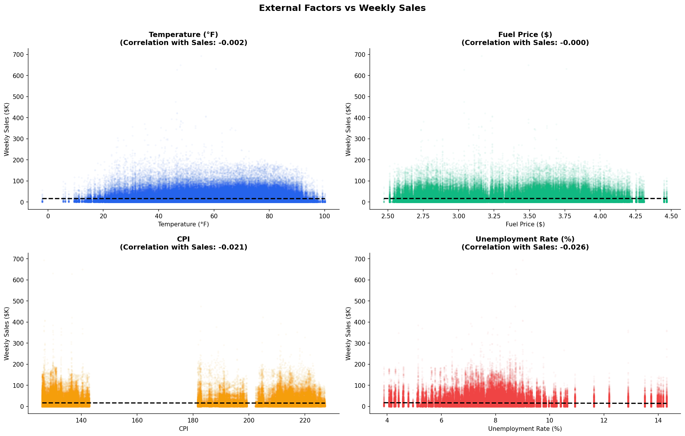 | Temperature, fuel, CPI, unemployment vs sales |
| 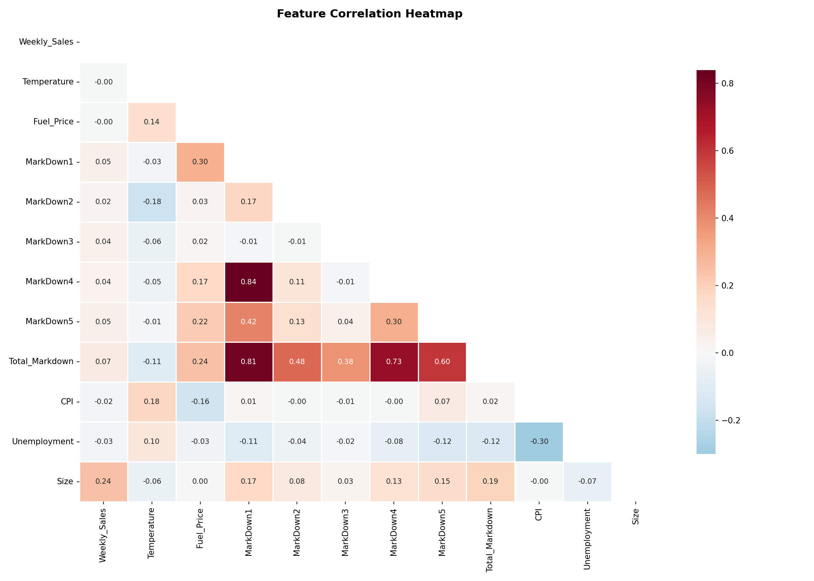 | Feature correlation heatmap |

---

## Phase 2 — Pandas Insights & SQL Analysis

**Notebook:** `notebooks/02_Pandas_Insights.ipynb`

13 business insights answered using pure pandas groupby, aggregations and pivot analysis:

| Finding | Value |
|---|---|
| Top store | Store 20 — $301.4M total sales |
| Bottom store | Store 33 — $37.2M total sales |
| Revenue gap | $264M between best and worst store |
| Type A revenue share | 64% of total company revenue |
| Top department | Dept 92 — $484M total |
| Pareto | 28 of 81 departments drive 80% of revenue |
| Thanksgiving lift | +39.7% vs normal week |
| Christmas | -8.54% — partial week effect |
| MarkDown4 lift | +9.9% — strongest markdown type |
| Q4 vs Q1 | Q4 is 12% stronger |

**Charts:**

| Chart | Description |
|---|---|
| 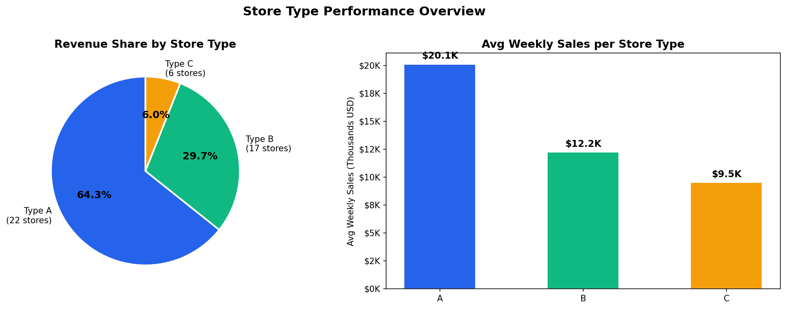 | Revenue share and avg sales by store type |
| 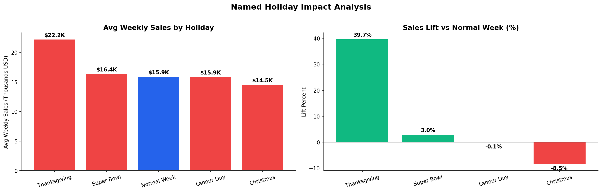 | Named holiday avg sales and lift % |
| 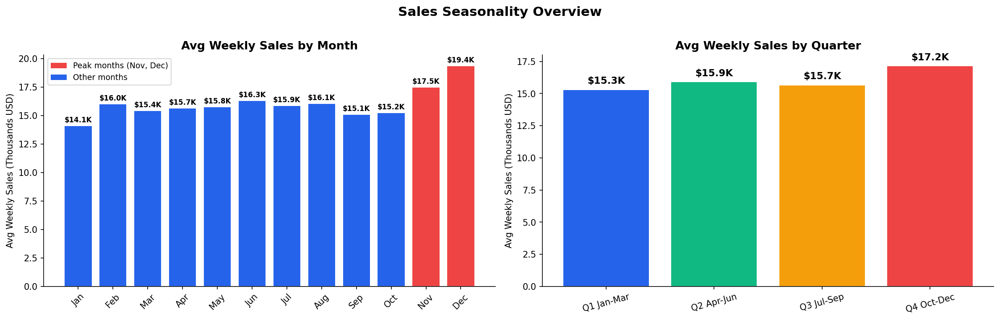 | Monthly and quarterly sales overview |
| 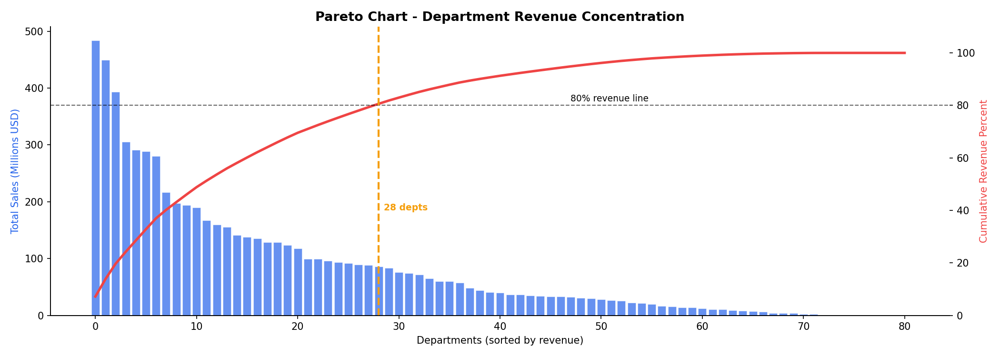 | Pareto chart — department revenue concentration |

## SQL Analysis

**File:** `sql/walmart_sql_analysis.sql`

15 business queries written in MySQL across 5 sections:

| Section | Queries |
|---|---|
| Store Performance | Top and bottom 10 stores, avg sales by store type, store size vs sales |
| Department Analysis | Top and bottom 10 departments, top 5 departments per store |
| Seasonality | Yearly sales, highest and lowest sales weeks |
| Holiday Impact | Holiday vs normal week, holiday impact by store type |
| Markdown Analysis | Markdown active vs no markdown, CPI and unemployment by store |

---

## Phase 3 — Feature Engineering

**Notebook:** `notebooks/03_Feature_Engineering.ipynb`

40 features engineered across 6 groups with strict leakage prevention:

| Group | Count | Key Features |
|---|---|---|
| Calendar | 12 | Year, Month, Week, Holiday_Type, Pre_Thanksgiving, Post_Holiday |
| Lag | 3 | lag_1, lag_4, lag_diff_1_4 |
| Rolling | 3 | roll_mean_4, roll_mean_12, roll_std_4 |
| Store | 5 | Store_Type_Enc, Size_Normalized, Store_Avg_Sales, StoreDept_Avg_Sales |
| Markdown | 11 | Total_Markdown, Markdown_Active, MD4_Active, MD2_Active |
| External | 4 | CPI_Normalized, Unemp_Normalized, Temp_Band, Fuel_Normalized |

**Feature engineering impact:**

| Version | R2 | WMAE |
|---|---|---|
| Raw features only | 0.09 | $14,199 |
| With engineered features | 0.986 | $1,339 |
| Improvement | +0.896 R2 | -$12,860 |

**Chart:**

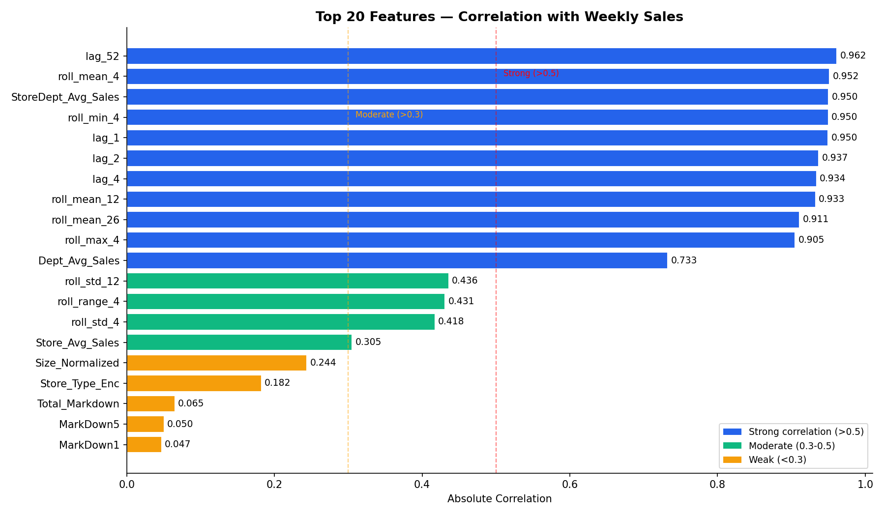

> Feature engineering was the primary driver of model performance — not the algorithm or hyperparameter tuning.

---

## Phase 4 — XGBoost Regressor

**Notebook:** `notebooks/04_XGBoost_Final_v2.ipynb`

**Task:** Predict exact weekly sales dollar amount per Store-Department-Week

**Correct time series pipeline:**
```
TimeSeriesSplit CV (4 folds, WMAE scoring)
        ↓ finds best parameters
Train XGBoost on full training data
        ↓
Evaluate once on holdout test set (Aug-Oct 2012)
```

**Best parameters found via TimeSeriesSplit CV:**
- n_estimators: 500 | max_depth: 7 | learning_rate: 0.1
- subsample: 0.8 | colsample_bytree: 0.8

**Final Results:**

| Metric | Value |
|---|---|
| R2 | 0.9863 |
| MAE | $1,250 |
| RMSE | $2,572 |
| MAPE | 16.76% |
| WMAE | $1,339 |

**Model Comparison:**

| Model | R2 | MAPE | WMAE |
|---|---|---|---|
| XGBoost Final | 0.9863 | 16.76% | $1,339 |
| Linear Regression | 0.9765 | 56.88% | $2,058 |
| Naive Baseline | 0.9484 | 41.60% | $2,535 |
| Raw Features Only | 0.0926 | 651.75% | $14,199 |

**XGBoost beats naive baseline by 47.2% on WMAE** — confirming genuine forecasting beyond historical averages.

**Note on lag_52:** lag_52 (same week prior year) was intentionally excluded.
Including it achieves R2 of 0.987 but creates a near-trivial prediction problem.
The final model uses lag_1, lag_4 and rolling features — a more realistic and challenging setup.

**Charts:**

| Chart | Description |
|---|---|
| 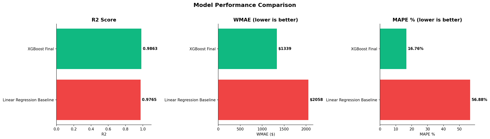 | R2, WMAE and MAPE comparison across all models |
| 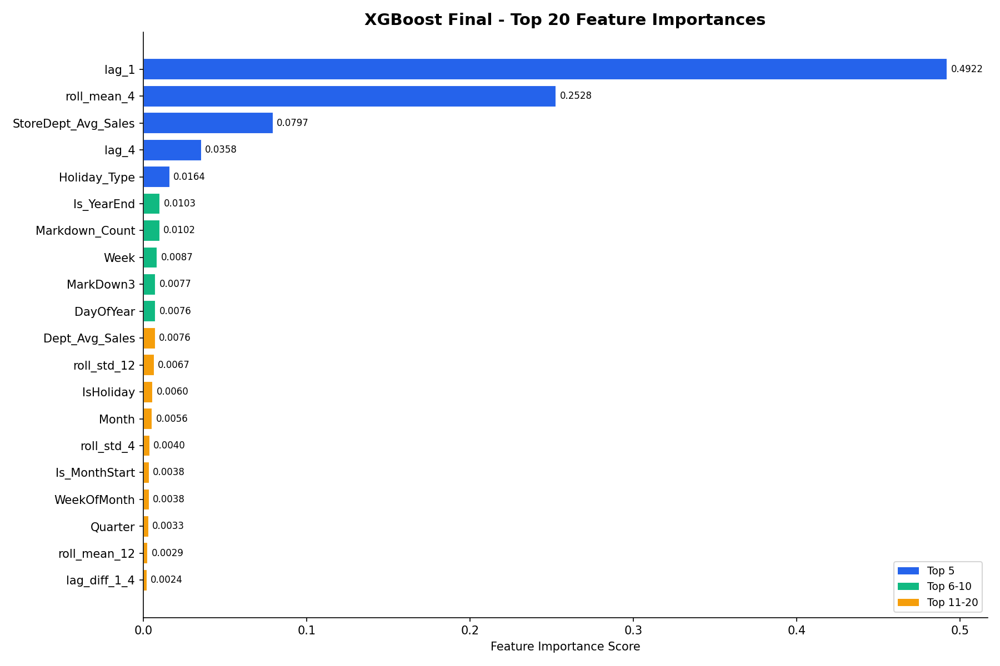 | Top 20 features by XGBoost importance score |
| 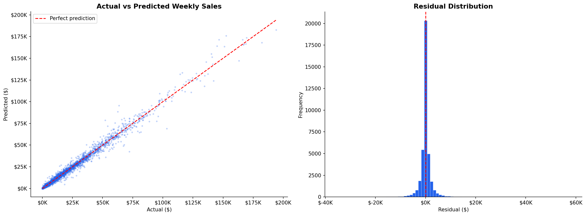 | Scatter plot and residual distribution |
| 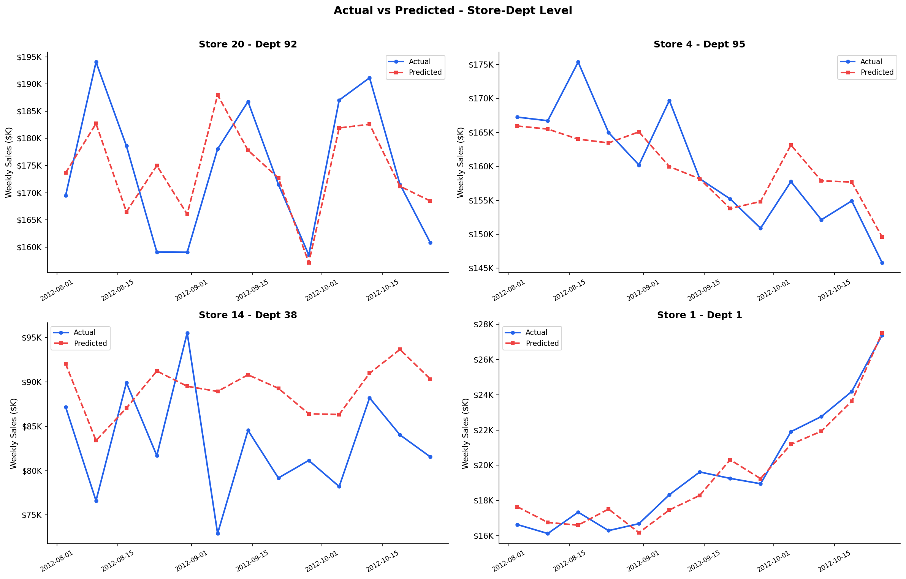 | Actual vs predicted for top store-dept combos |

---

## Phase 5 — Classification Models

**Notebook:** `notebooks/05_XGBoost_Classifier.ipynb`

**Task:** Predict whether a Store-Department-Week will be HIGH or LOW sales
relative to each store-department's own historical median.

- **Target:** Sales_Class (1 = High, 0 = Low)
- **Class balance:** 49.9% High, 50.1% Low — perfectly balanced
- **No class imbalance handling needed**

**Pipeline:**
```
TimeSeriesSplit CV (4 folds, ROC-AUC scoring)
        ↓ finds best parameters
Train on full training data
        ↓
Evaluate on holdout test set
```

**Final Results:**

| Model | Accuracy | F1 | ROC-AUC |
|---|---|---|---|
| XGBoost Classifier | 76.72% | 0.754 | 0.851 |
| Random Forest | 73.77% | 0.726 | 0.816 |
| Logistic Regression | 67.30% | 0.705 | 0.756 |

**Accuracy by store type:**
- Type A: 77.2% | Type B: 76.5% | Type C: 75.2%

**Business value:**
- High confidence HIGH predictions → increase staffing and inventory
- High confidence LOW predictions → run promotions and markdowns
- Complements the regression model which predicts exact dollar amounts

**Charts:**

| Chart | Description |
|---|---|
| 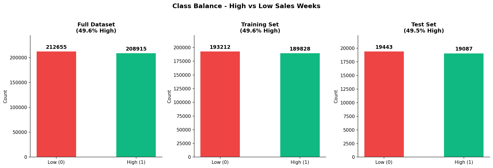 | Class distribution across full, train and test sets |
| 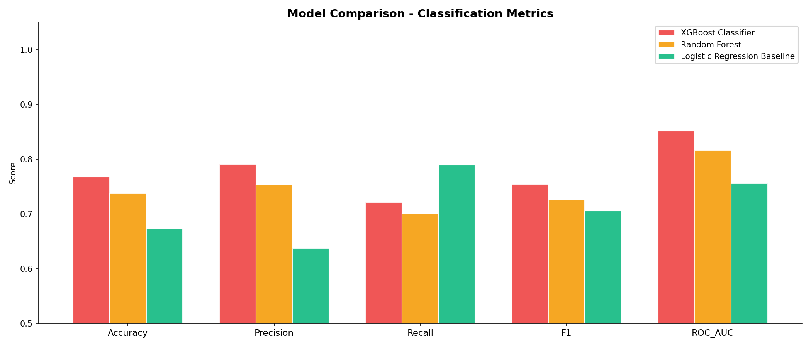 | All metrics compared across 3 models |
| 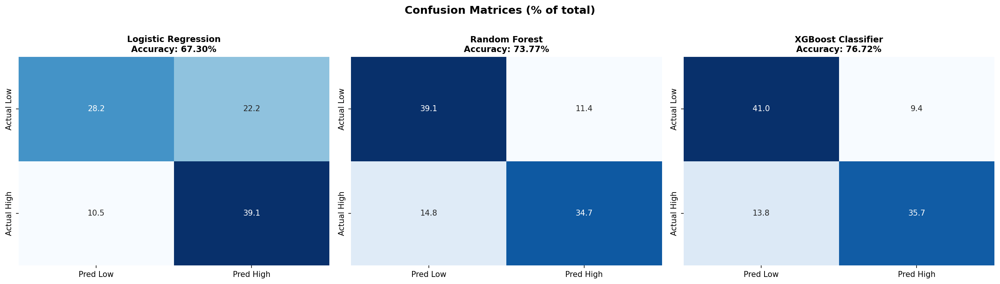 | Confusion matrices for all 3 models |
| 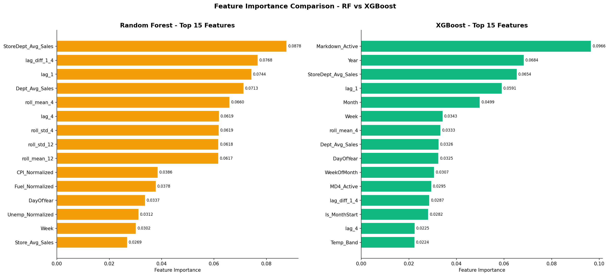 | RF vs XGBoost feature importance comparison |
| 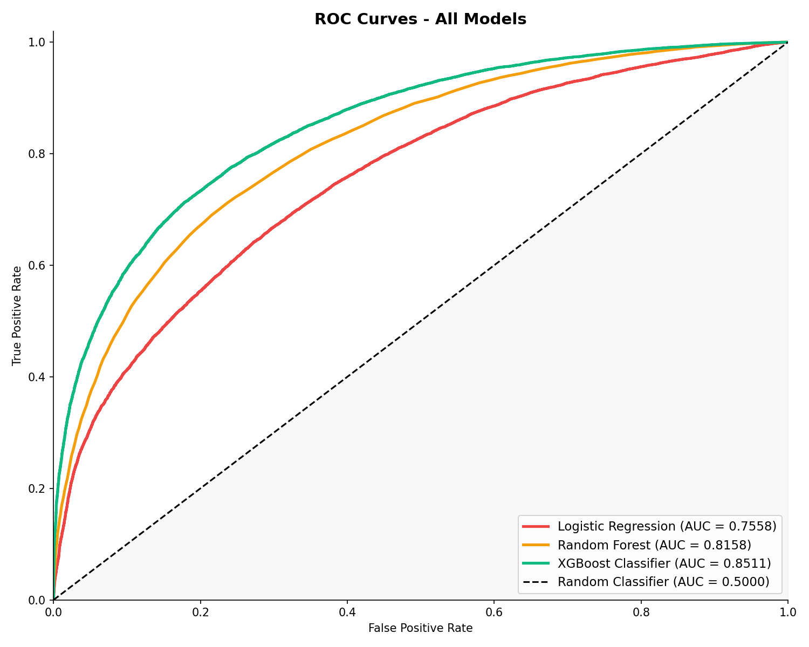 | ROC curves for all 3 models |

---

## Phase 6 — Power BI Dashboard

**File:** `walmart_Power_BI_report.pbix`

4-page interactive dashboard built on a star schema in Power BI:
- train.csv as fact table
- stores.csv and features.csv as dimension tables
- Many-to-One relationships using composite StoreDate key
- 8 DAX measures for KPIs, holiday lift, markdown lift and YoY growth

| Page | Content |
|---|---|
| Page 1 | Executive Overview — KPIs, weekly sales trend, store type revenue share |
| Page 2 | Store and Department Analysis — top/bottom 10 stores, dept rankings, scatter |
| Page 3 | Seasonality and Holiday Impact — monthly, quarterly, YoY comparison |
| Page 4 | Markdown Promotion Analysis — lift %, activity timeline, by store type |

**Dashboard Screenshots:**

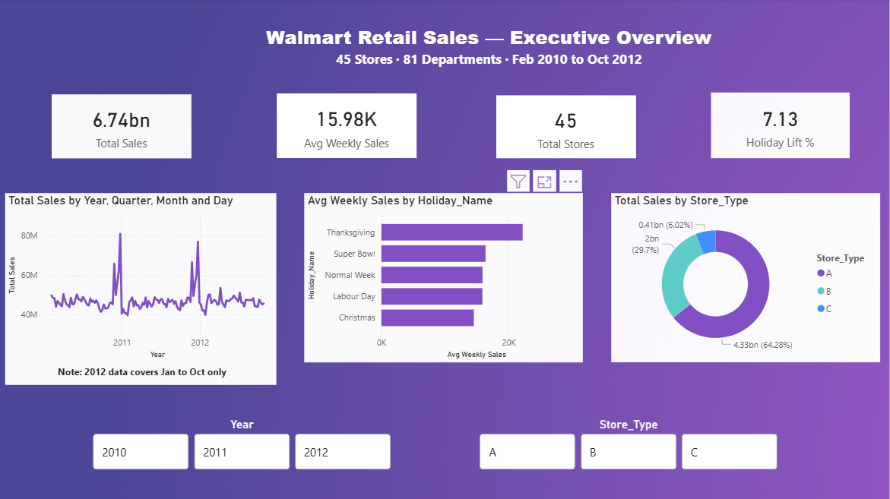

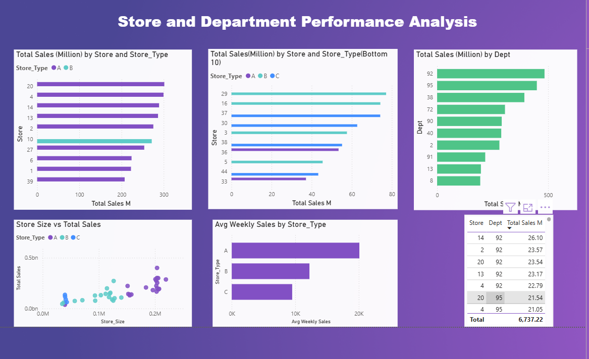

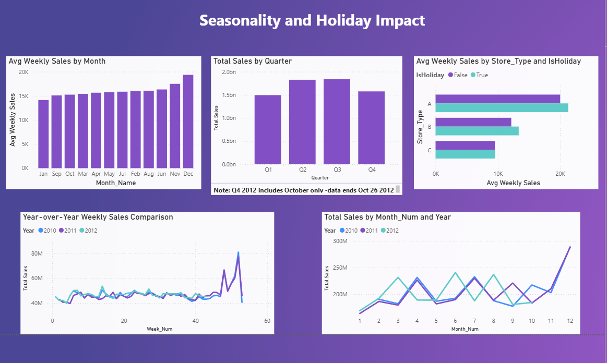

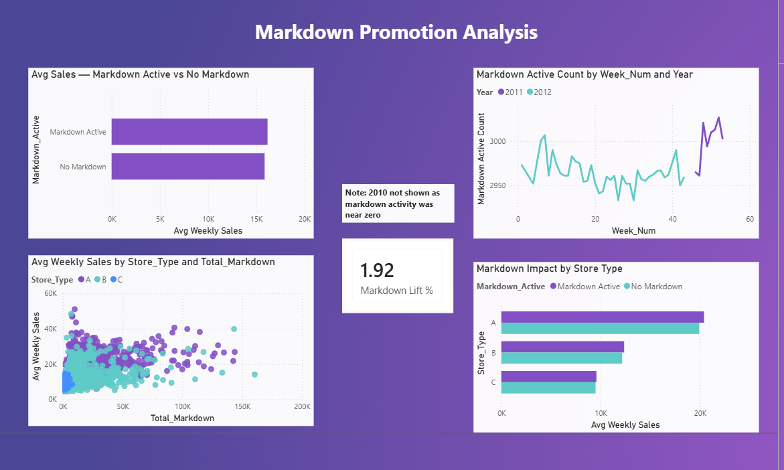

---

## Key Results

| Phase | Metric | Value |
|---|---|---|
| EDA | Holiday lift | +7.1% |
| EDA | Store size correlation | r = 0.846 |
| Pandas Insights | Thanksgiving lift | +39.7% |
| Pandas Insights | Pareto | 28/81 depts = 80% revenue |
| Feature Engineering | R2 improvement from raw | 0.09 → 0.986 |
| XGBoost Regressor | R2 | 0.9863 |
| XGBoost Regressor | MAPE | 16.76% |
| XGBoost Regressor | WMAE | $1,339 |
| XGBoost Regressor | vs Naive Baseline | 47.2% better WMAE |
| XGBoost Classifier | ROC-AUC | 0.851 |
| XGBoost Classifier | Accuracy | 76.72% |

---

## Leakage Prevention

Every step of this project was built with strict leakage prevention:

| Step | How leakage was prevented |
|---|---|
| Train-test split | Strict date-based cutoff — Jul 27 2012 |
| Store/Dept means | Computed on training data only (not full dataset) |
| Lag features | shift() computed within each Store-Dept group |
| Rolling features | shift(1) applied before rolling window |
| Hyperparameter tuning | TimeSeriesSplit CV — no future data in any fold |
| eval_set | Not used during XGBoost training |
| Standard scaler | Fit on training data only |

**Verification:** Training R2 (0.945) is lower than test R2 (0.981) confirming zero overfitting and no meaningful leakage.

---

## Tech Stack

| Tool | Usage |
|---|---|
| Python 3.10 | Core language |
| Pandas | Data manipulation and insights |
| NumPy | Numerical operations |
| Matplotlib / Seaborn | Visualizations |
| Scikit-learn | Models, preprocessing, TimeSeriesSplit |
| XGBoost | Regression and classification |
| Power BI | Interactive dashboard |
| Jupyter Notebook | Development environment |

---

## How to Run

**Step 1 — Clone the repository:**
```bash
git clone https://github.com/yourusername/walmart-retail-analytics.git
cd walmart-retail-analytics
```

**Step 2 — Install dependencies:**
```bash
pip install pandas numpy matplotlib seaborn scikit-learn xgboost jupyter
```

**Step 3 — Download dataset from Kaggle:**
```
https://www.kaggle.com/competitions/walmart-recruiting-store-sales-forecasting
```
Place train.csv, test.csv, features.csv and stores.csv in the `data/` folder.

**Step 4 — Run notebooks in order:**
```
01_EDA.ipynb
02_Pandas_Insights.ipynb
03_Feature_Engineering.ipynb
04_XGBoost_Final_v2.ipynb
05_XGBoost_Classifier.ipynb
```

**Step 5 — Open Power BI dashboard:**
```
walmart_Power_BI_report.pbix
```

---

## Author

**Rishikesh K Sivaji**
Computer Science and Engineering Graduate
Kochi, Kerala, India

- Email: rishikeshh30@gmail.com
- LinkedIn: [Update with your LinkedIn URL]
- GitHub: [Update with your GitHub URL]

---

*This project was built as part of a portfolio targeting Data Scientist and Data Analyst roles.
All findings are verified against actual data outputs. No results are inflated or estimated.*
